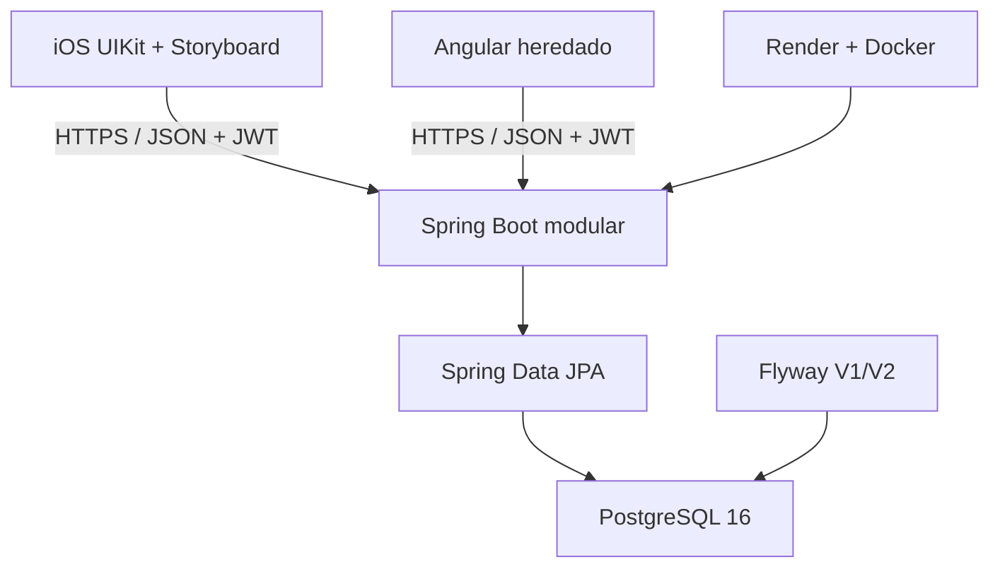
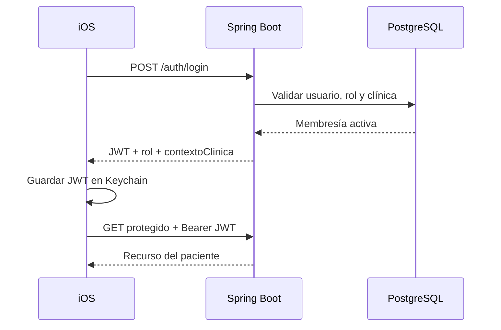

# Arquitectura de software

## 1. Estilo arquitectónico

DentiCore Connect utiliza una arquitectura cliente-servidor con un **monolito modular Spring Boot** y una base PostgreSQL compartida por módulos. La aplicación iOS es un cliente nativo; el frontend Angular heredado permanece como back-office. No existe API Gateway ni despliegue de microservicios en el Release 0.1.

## 2. Componentes

### Aplicación iOS

- UIKit y `Main.storyboard` como composición principal.
- `UIViewController`, `UINavigationController` y `UITabBarController`.
- `URLSession` encapsulado por `APIClient`.
- DTOs `Codable` separados de entidades Core Data.
- Keychain para JWT.
- Core Data para caché de citas.
- UserNotifications para recordatorios locales.
- `DentiCoreTheme` como sistema de tokens y estilos.

### Backend

Los paquetes representan módulos dentro de una sola aplicación:

| Módulo | Responsabilidad |
|---|---|
| `security` | Login, JWT, roles, membresía y registro |
| `organizacion` | Clínica y sede |
| `catalogo` | Especialidades y servicios |
| `agenda` | Horarios y bloqueos |
| `crm` | Citas, estados y eventos |
| `movil` | Fachada REST orientada al paciente |
| `clinica` | Activos heredados de atención y odontograma |
| `ventas` | Modelo heredado, fuera del flujo móvil 0.1 |
| `common` | Errores uniformes |

### Persistencia

- PostgreSQL 16.
- Esquemas: `seguridad`, `organizacion`, `catalogo`, `agenda`, `crm`, `clinica` y `ventas`.
- Flyway aplica `V1__legacy_baseline.sql` y `V2__denticore_connect_release_01.sql`.
- El perfil `demo` añade `R__demo_data.sql` y bootstrap de credenciales de demostración.
- Hibernate valida el esquema con `ddl-auto=validate`.

## 3. Flujo de autenticación

## 4. Flujo de una cita

1. iOS consulta servicio, odontólogo y disponibilidad.
2. El backend resuelve paciente y clínica desde el usuario autenticado; no acepta `idPaciente` del cliente.
3. Se calcula el rango inicio/fin según duración del servicio.
4. PostgreSQL rechaza solapamientos mediante una restricción de exclusión GiST.
5. La cita se crea en `PENDIENTE` y se registra un evento `CREADA`.
6. iOS actualiza la caché y programa recordatorios locales.

## 5. Seguridad

- TLS provisto por Render.
- JWT stateless firmado con `JWT_SIGNING_SECRET`.
- BCrypt para contraseñas.
- `@PreAuthorize` para el rol paciente en la fachada móvil.
- Propiedad de cita verificada con el principal autenticado y clínica.
- Secretos suministrados por variables de entorno.
- Health check sin detalles internos.
- DNI oculto por defecto en iOS.

## 6. Disponibilidad y fallos

- La instancia gratuita de Render puede entrar en reposo; el cliente presenta carga y error recuperable.
- Core Data mantiene el último listado de citas exitoso.
- La reserva exige red; no se encola offline para evitar conflictos.
- Los recordatorios son locales y no sustituyen una infraestructura de notificación push.

## 7. Decisiones registradas

| Decisión | Motivo | Consecuencia |
|---|---|---|
| Monolito modular | Equipo pequeño y plazo corto | Menor complejidad operativa |
| Fachada `/pacientes/me` | Evitar confiar en IDs del cliente | Mejor autorización por propiedad |
| PATCH para cancelar | Cancelación es transición, no borrado | Conserva auditoría |
| Core Data solo como caché | Servidor es fuente de verdad | Sin escrituras offline conflictivas |
| Notificaciones locales | Viable sin APNs | Dependen del dispositivo |
| UIKit + Storyboard | Alineación académica | Outlets/actions/segues visibles |
| Flyway | Evolución determinista | Migraciones aplicadas son inmutables |

## 8. Evolución posterior

Release 0.2 puede incorporar reprogramación, edición controlada de contacto, selección de clínica, avatar remoto y notificaciones push. La transición a multitenancy comercial requiere pruebas de aislamiento, administración de tenants, auditoría, observabilidad y políticas de datos antes de incorporar clientes reales.
