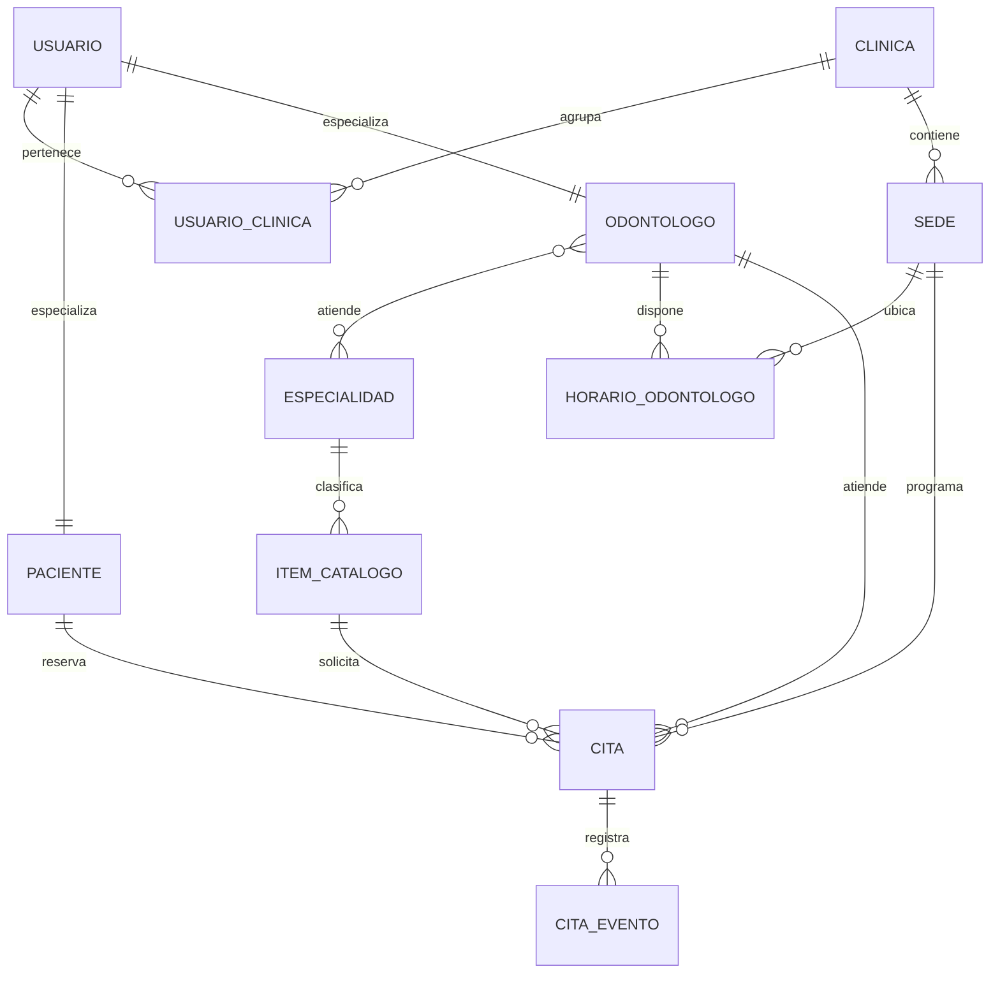

# Modelo de datos y migraciones

## 1. Fuente de verdad

La estructura desplegable se define mediante Flyway en:

- `backend/src/main/resources/db/migration/V1__legacy_baseline.sql`
- `backend/src/main/resources/db/migration/V2__denticore_connect_release_01.sql`

`database/init/DATABASE_SCHEMA.sql` permanece como referencia heredada y no debe ejecutarse sobre una base ya administrada por Flyway. Hibernate utiliza `ddl-auto=validate`.

## 2. Esquemas

| Esquema | Entidades principales | Estado en R0.1 |
|---|---|---|
| `seguridad` | usuario, rol, usuario_rol, paciente, odontólogo, usuario_clinica | Operativo |
| `organizacion` | clínica, sede | Operativo |
| `catalogo` | especialidad, item_catalogo, odontologo_especialidad | Operativo |
| `agenda` | horario_odontologo, bloqueo_horario | Operativo |
| `crm` | cita, cita_evento, lead_contacto | Operativo |
| `clinica` | historia, atención, odontograma | Heredado; fuera de iOS 0.1 |
| `ventas` | transacción y detalle | Heredado; fuera de iOS 0.1 |

## 3. Relaciones esenciales

## 4. Integridad de agenda

`crm.cita` almacena inicio y fin como `TIMESTAMPTZ`. La extensión `btree_gist` permite una restricción de exclusión por odontólogo y rango temporal para estados activos. Esta restricción es la última barrera ante dos solicitudes concurrentes.

La cancelación modifica estado y metadatos; no elimina la fila. `crm.cita_evento` conserva la trazabilidad de creación, reprogramación futura y cancelación.

## 5. Multiclínica

`seguridad.usuario_clinica` vincula usuario, clínica y rol. Cada cita guarda `id_clinica` e `id_sede`. Esta estructura prepara el producto para múltiples clínicas, pero la administración y validación exhaustiva de aislamiento por tenant quedan fuera del Release 0.1.

## 6. Datos demo

El perfil `demo` incorpora datos ficticios desde `R__demo_data.sql`. El bootstrap crea o actualiza el paciente de demostración con variables de entorno:

- `DEMO_PATIENT_DNI`
- `DEMO_PATIENT_EMAIL`
- `DEMO_PATIENT_PASSWORD`
- `DEMO_PATIENT_NAMES`
- `DEMO_PATIENT_SURNAMES`

Las dos últimas variables no son secretas y permiten personalizar una identidad ficticia sin modificar código. El bootstrap sincroniza el nombre aunque el usuario ya exista y crea, una sola vez, una cita histórica `ATENDIDA` con el canal interno `DEMO_SEED`. Esa cita permite demostrar el historial y no es cancelable.

Los secretos no deben incluirse en migraciones, documentación ni commits.

## 7. Evolución

Para modificar la estructura:

1. crear `V3__descripcion.sql`;
2. actualizar entidades JPA;
3. actualizar `DATA_MODEL.md` y `openapi.yaml` si el contrato cambia;
4. ejecutar pruebas sobre una base nueva y otra migrada;
5. no editar `V1` o `V2` después de haber sido aplicadas.
