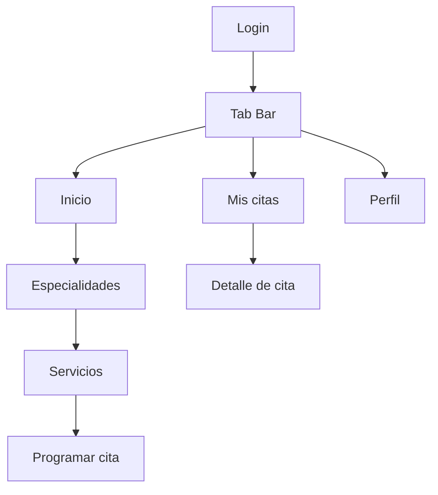

# Arquitectura de clientes

## 1. Aplicación iOS

La aplicación sigue una separación pragmática compatible con UIKit y Storyboard:

```text
App / Scene
  └── AuthenticationFlow
Features
  ├── Auth
  ├── Home
  ├── Catalog
  ├── Appointments
  └── Patient
Networking
  ├── APIClient
  └── APIError
Session
  ├── KeychainService
  └── SessionManager
Persistence
  └── AppointmentCache (Core Data)
Notifications
  └── LocalNotificationService
Design
  └── DentiCoreTheme
```

### Responsabilidades

- Los `ViewController` coordinan la interacción de la pantalla.
- Los servicios construyen peticiones y traducen resultados de red.
- Los modelos API son `Codable` y no dependen de UIKit.
- `AppointmentCache` traduce DTOs hacia/desde Core Data.
- `AuthenticationFlow` concentra el cierre por logout o expiración.
- `DentiCoreTheme` evita colores y estilos arbitrarios.

### Reglas UIKit

- Las pantallas principales se declaran en `Main.storyboard`.
- Los controles se conectan mediante `@IBOutlet` y `@IBAction`.
- La navegación declarativa usa segues y `prepare(for:sender:)`.
- Los listados usan `UITableViewDataSource`, `UITableViewDelegate` y celdas reutilizables.
- La actualización de UI se ejecuta en el hilo principal.
- Las celdas encapsulan su mapeo en `configure(with:)`.
- `UIStackView` agrupa contenido y reduce restricciones manuales.

### Estado de pantalla

Cada pantalla remota debe representar:

1. carga;
2. contenido;
3. vacío;
4. error recuperable;
5. sesión expirada;
6. contenido offline, cuando exista caché.

## 2. Navegación iOS



## 3. Persistencia local

Core Data conserva una proyección de citas por DNI de sesión. No guarda token, contraseña ni datos clínicos sensibles. El servidor sigue siendo la fuente de verdad y reemplaza la caché después de cada consulta satisfactoria.

## 4. Cliente Angular heredado

`frontend/` contiene el back-office desarrollado antes del cliente móvil. Se mantiene como activo heredado para gestión clínica. No es el foco del Release 0.1 y sus módulos de facturación no deben considerarse parte del incremento móvil ni capacidad productiva validada.

## 5. Convenciones

- Nombres de tipos en inglés cuando representan contratos técnicos (`PatientAppointment`, `APIClient`).
- Textos visibles al usuario en español.
- DTOs defensivos únicamente donde el contrato permita `null`; no se convierte todo campo en opcional sin necesidad.
- Identificadores de segue descriptivos: `showMain`, `showServices`, `showAppointment`, `showAppointmentDetail`.
- No se realizan llamadas directas a `URLSession` desde los controladores.
